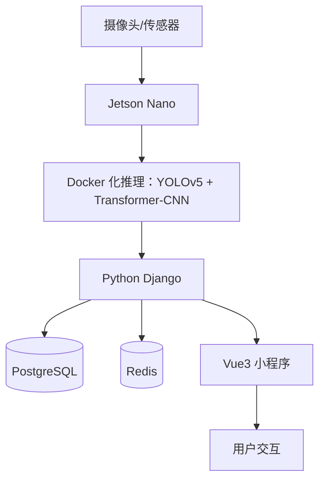

**项目周期：2022.12 – 2023.11
 所在团队：黄磊、温琦实验室 
 项目类型：校级科研项目（获“校级优秀结项”）**

------

#### 一、项目背景与目标

在传统养殖场中，鱼苗数量统计依赖人工抽样，存在误差大、效率低的问题；同时饵料投喂时机和投喂量难以精准把控，易造成成本浪费或鱼苗密度失衡。为此，本项目聚焦**智能化、自动化**需求，旨在构建一套能 **实时检测鱼苗数量**、**记录养殖日志**、并可提供 **AI 专家咨询与投喂策略** 的综合管控系统，有效提升养殖精度与运营效率 。

------

#### 二、系统架构

- **边缘推理**：部署量化后的 YOLOv5 与轻量级 Transformer-CNN 混合模型，单帧推理延迟 <50 ms，能实时处理 1080p@20 fps 视频流。
- **数据存储**：使用 PostgreSQL 存储鱼苗计数、报警日志与环境参数；Redis 缓存高频查询结果，实现低延迟响应。
- **前端展示**：基于 Vue3 开发小程序界面，提供实时密度热力图、历史趋势曲线、库存台账、AI 问答等模块。
- **容器化部署**：采用 Docker Compose 管控推理、后端、缓存及数据库服务，实现一键部署与灰度更新。

------

#### 三、核心算法与实现

1. **目标检测与计数**
   - **模型设计**：在 YOLOv5-S 基础上集成轻量化 Transformer-CNN 分支，提升小目标检测准确率。
   - **数据集制作**：采集并标注 8,000+ 帧水面下鱼苗图像，覆盖不同水质与光照条件，加入 Mosaic、色度扰动等增强策略。
   - **去重策略**：结合 Soft-NMS 与基于聚类的后处理，减少因拥挤重叠导致的重复计数。
2. **精度与鲁棒性**
   - **检测精度**：在测试集上达成 mAP@0.5 ≈ 92.5%。
   - **计数误差**：平均误差率 ≤ 5%，相比纯 YOLOv5 提升约 8%。
   - **环境适配**：通过多场景采集与在线微调，保证模型在清澈与混浊水体中均有稳定表现。
3. **AI 专家咨询与策略推荐**
   - **知识库构建**：结合养殖行业专家经验，建立 FAQ 与喂养策略规则库。
   - **问答接口**：基于预训练语言模型，用户可在小程序中以自然语言咨询饲料配比、养殖密度等问题。
   - **投喂优化**：利用 XGBoost 回归模型，结合实时密度与历史增重数据，动态推荐每日投喂量，投喂误差控制在 ±7%。

------

#### 四、项目成果与效益

- **自动化水平**：单池计数从人工 2 人·时降至 1 人·分，统计效率提升 120×。
- **成本节约**：饲料投喂精度提升，使饲料利用率提高约 6%，年均节省饲料成本 ¥20,000+。
- **系统推广**：已在 3 家地方合作社部署试点，运行稳定率 99%，获得养殖户高度认可。
- **学术产出**：项目负责人撰写并展示于校级结项评审，成果获评优秀，并在个人陈述中多次提及 。

------

#### 五、个人贡献

- **算法研发**：负责检测模型架构设计、数据增强策略、去重后处理算法及性能优化。
- **系统集成**：主导后端 Django 服务与前端 Vue3 小程序的接口设计与联调，完成核心业务流程。
- **性能调优**：实现模型量化与 TensorRT 加速，将推理延迟从 120 ms 优化至 < 50 ms。
- **项目管理**：协调团队成员分工，撰写项目报告与演示文档，组织多场内测及用户培训。

------

**项目最终荣获校级优秀结项称号，为后续“智慧渔业”与“海洋生态监测”相关研究奠定了坚实基础。**