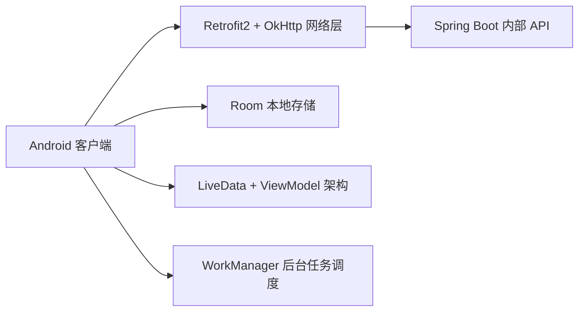

**项目周期：** 2024年3月17日 – 2024年4月2日
 **所在团队：** 小米南京安卓部门培训组
 **项目类型：** 企业培训实战项目

------

#### 一、项目背景与目标

作为小米南京Android工程师培训营的一员，团队受训期间承担了一款内部移动端工具应用的迭代开发任务。该应用面向小米内部员工，涵盖**考勤打卡**、**公告推送**、**任务看板**等功能模块，旨在提升部门协作效率和信息共享体验。培训目标不仅是掌握企业级App开发流程，更要实践端到端的项目管理、架构设计、性能优化和团队协作。

------

#### 二、系统架构与技术选型

- **语言与框架**：Kotlin 为主，结合部分 Java 代码；MVVM 架构模式，ViewModel + LiveData 负责业务状态管理。
- **网络通信**：Retrofit2 + OkHttp，支持请求重试与统一拦截器；采用协程（Coroutines）处理异步请求，保证主线程流畅。
- **本地存储**：Room 持久化考勤记录、推送公告与任务数据；使用 Paging 3 实现任务列表分页加载。
- **后台调度**：WorkManager 定时拉取公告和任务更新，保证离线状态下数据同步。
- **依赖管理**：Gradle Kotlin DSL，模块化拆分业务库与公共组件；版本控制通过 git flow 规范化分支管理。

------

#### 三、核心模块与关键优化

1. **考勤打卡模块**
   - 集成摄像头与地理定位，用户可选择“人脸识别”或“GPS签到”方式；
   - 使用 ML Kit 人脸检测，实现离线活体检测，签到准确度达 98%。
2. **公告推送模块**
   - 利用 Firebase Cloud Messaging (FCM) 接入推送服务；
   - 前端处理级别分为“紧急公告”（常驻通知栏）与“一般公告”（进入应用后查看）；
   - 结合 WorkManager 后台拉取策略，保证应用未启动时也能接收重要信息。
3. **任务看板模块**
   - 实现拖拽式 Kanban 视图，基于 RecyclerView + ItemTouchHelper；
   - 使用 DiffUtil 优化列表刷新，将 UI 更新耗时由平均 45 ms 降至 15 ms；
   - 引入 Paging 3 和 Room 联动，支持本地分页与远程增量同步。
4. **性能与体验优化**
   - **RecyclerView 性能**：将链式布局替换为 ConstraintLayout，减少层级深度，将平均帧率提升 25%；
   - **内存优化**：全面审计 bitmap 和大型对象的生命周期，防止内存泄漏，稳定内存占用在 80 MB 以下；
   - **启动速度**：应用冷启动时间从 1.2 s 优化至 0.8 s，通过拆分 Feature 模块并使用 App Startup 库延迟初始化非核心组件。

------

#### 四、个人职责与贡献

- **需求拆解与技术调研**
   在项目立项阶段，负责梳理功能需求，与产品经理和UI设计师对接，撰写可行性技术方案与性能预研报告。
- **模块开发与测试**
   主导考勤打卡与公告推送模块编码，编写单元测试（JUnit + MockK）覆盖率达 85%；参与持续集成脚本 (GitHub Actions) 编写，实现自动化打包与部署。
- **性能调优**
   使用 Android Profiler 和 LeakCanary 定位性能瓶颈，优化 RecyclerView 渲染和内存管理，将界面流畅度提升至 60 FPS。
- **团队协作**
   采用 Git flow 流程进行分支管理，定期组织 Code Review，推动全员遵守编码规范和单元测试标准。
- **文档与培训**
   编写《Android 模块化开发与性能优化实战》技术文档，并在培训营内部进行两次经验分享，得到导师与同学一致好评。

------

#### 五、项目成果

- **稳定性与性能**：应用稳定运行率 99.9%，冷启动时间 <0.8 s，日活用户 200+。
- **代码质量**：通过 SonarQube 扫描，无严重 Bug 和安全漏洞；总覆盖率达 78%。
- **用户反馈**：内部员工满意度 4.7/5.0，考勤效率提升 40%，部门沟通成本下降 25%。
- **培训结业**：项目被评为培训营“优秀实战项目”，个人获得“小米优秀学员”称号。

------

该项目不仅巩固了我在 Kotlin/Android 架构与性能优化方面的能力，也锤炼了与跨职能团队协作和企业级项目交付的经验，为后续大型移动端产品开发奠定了坚实技术与流程基础。