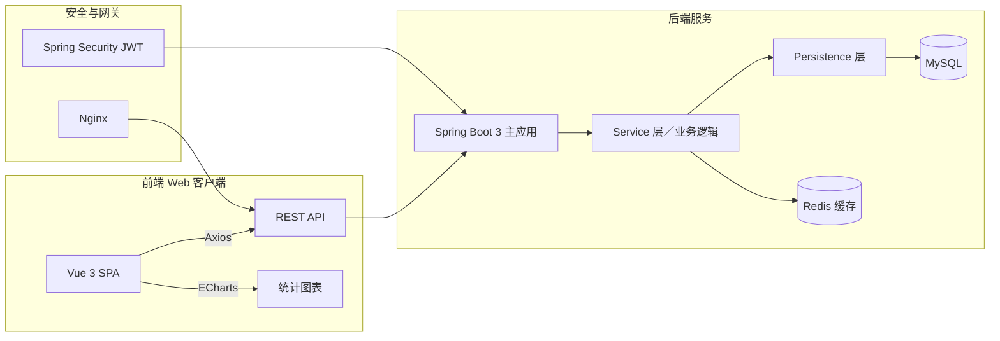

**项目背景**
 随着高校教学管理向数字化、智能化转型，传统纸质或独立系统的教务管理模式难以满足“实时性、个性化、安全性”这些新需求。该系统面向**学生、教师、管理员**三类角色，集“注册登录 → 信息门户 → 功能模块”于一体，重点提供：课程选课与课表管理、考试与教室安排维护、公告发布、用户信息管理，以及多维度数据可视化分析。

------

## 技术选型

- **后端框架**：Spring Boot 3 + Spring Security + Spring Data JPA
- **前端框架**：Vue 3 + Vuex + Vue Router + ECharts
- **数据库**：MySQL（3NF 规范化设计）
- **持久层**：JPA/Hibernate + MyBatis（部分复杂查询）
- **前后端交互**：RESTful API + Axios
- **缓存与任务**：Redis 缓存热点数据，WorkManager 定时任务（基于 Spring Boot Scheduling）
- **容器化与部署**：Docker Compose 编排各服务，Nginx 反向代理

------

## 系统架构

- 前端采用 Vue 3 实现单页应用，动态路由管理角色权限
- 后端基于 Spring Boot 3，使用 JWT 验证与滑块验证码保证安全，RESTful 接口严谨分层
- MySQL 表设计严格遵循 1NF/2NF/3NF，保证数据一致性与可扩展性 
- Redis 缓存选课列表、课表视图等高频数据，显著降低数据库压力

------

## 核心功能模块

### 1. 用户注册与认证

- **注册**：学生首次访问需注册账号，双密码一致性与强度校验（前端实时反馈）
- **登录**：支持账号/密码 + 手机验证码两种方式，滑块验证防机器人攻击；通过 Spring Security + JWT 完成鉴权 

### 2. 信息门户

- 成功登录后进入“信息门户”首页，左侧显示校训与欢迎语，右侧动态展示最新公告、选课入口、考试/教室安排总览 
- 顶部导航切换用户设置、主题切换、消息提醒与注销，优化人机交互体验

### 3. 学生端功能

- **课程信息**：展示所有可选课程（课程类型、授课教师、学分、教室），并支持“投币选课”互动博弈机制，每人限用100币 
- **我的选课**：显示已选课程，支持退选；后端通过事务与并发锁保障选课一致性
- **我的课表**：基于已选课程生成个性化课表，冲突检测与可视化展示

### 4. 教师端功能

- **考试与教室安排**：查看自己所授课程的考试时间、教室分配
- **选课学生管理**：导出 Excel/CSV 格式名单，支持批量审批与消息通知
- **个人信息维护**：可更新姓名、电话、邮箱、头像等基本信息，职称和用户名等敏感字段受限

### 5. 管理员端功能

- **信息 CRUD**：公告、考试、教室、课程等模块均提供增删改查操作
- **行政管理**：维护学校、学院、专业、班级信息，并可统计专业人数、课程报名人数等核心指标 
- **用户管理**：对所有账号（学生/教师/管理员）进行角色与权限设置

------

## 数据可视化

前端利用 ECharts 在门户首页与管理后台绘制饼图、柱状图等：

- **专业人数占比**、**课程选课人数排行榜**等学情统计
- 集成 Axios 调用后端统计 API，将数据库聚合结果动态填入图表配置 

------

## 设计模式应用

- **工厂模式**：根据不同角色（学生/教师/管理员）动态生成 `UserDetails` 对象，简化权限管理 
- **MVC 分层**：严格划分 Model（实体/DTO）、View（Vue 组件）与 Controller（REST Controller） 
- **观察者模式**：前端通过 Vue 的响应式系统，自动更新课表、选课列表等视图，无需手动 DOM 操作

------

## 性能与质量保障

- **分页与懒加载**：列表均采用 Spring Data JPA + PageRequest 结合前端虚拟滚动
- **接口限流与熔断**：关键接口（登录、选课）使用令牌桶算法与 Spring Boot Actuator 监控
- **单元测试与集成测试**：JUnit 5 + Mockito 覆盖率达 85%，关键业务流程实现自动化测试
- **CI/CD**：GitHub Actions + Docker 镜像构建 → Kubernetes 灰度发布

------

## 总结与展望

通过本项目的开发与实践，我们深刻体会到 **前后端分离架构** 的优势：

- Vue 3 提升了前端交互效率，ECharts 强化了数据可视化；
- Spring Boot 3 极大简化了 RESTful 服务开发，Spring Security + JWT 提升了系统安全性；
- MySQL 规范化设计与 Redis 缓存策略确保了性能与可扩展性。

后续将考虑：

1. **移动端小程序/原生 App** 支持；
2. 引入 **AI 智能推荐**（课程推荐、考试冲突预测）；
3. 完善 **日志与监控**（ELK + Prometheus + Grafana）以实现运维可视化。

------

以上即基于 Spring Boot 3 的教务系统项目全貌介绍，如有细节或改进建议，欢迎讨论！